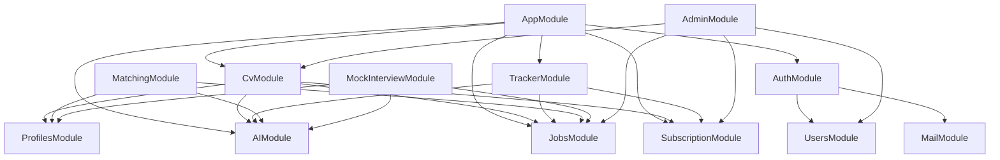

# System Architecture

## Application Architecture

```
┌───────────────────────────────────────────────────────────────┐
│                      CLIENT (Frontend)                         │
└─────────────────────────────┬─────────────────────────────────┘
                              │ HTTP/REST
┌─────────────────────────────▼─────────────────────────────────┐
│                        NestJS Main App                         │
│ ┌─────────────────────────────────────────────────────────┐   │
│ │                    Controllers Layer                      │   │
│ │  AuthController, JobsController, CvController, ...       │   │
│ └─────────────────────────────┬─────────────────────────────┘   │
│ ┌─────────────────────────────▼─────────────────────────────┐   │
│ │                    Services Layer                          │   │
│ │  AuthService, JobsService, GeminiService, ...            │   │
│ └─────────────────────────────┬─────────────────────────────┘   │
│ ┌─────────────────────────────▼─────────────────────────────┐   │
│ │                  Repository/Entity Layer                   │   │
│ │  TypeORM Repositories with PostgreSQL                     │   │
│ └───────────────────────────────────────────────────────────┘   │
└─────────────────────────────┬─────────────────────────────────┘
                              │
        ┌─────────────────────┼─────────────────────┐
        │                     │                     │
┌───────▼───────┐     ┌───────▼───────┐     ┌───────▼───────┐
│  PostgreSQL   │     │     Redis     │     │    AWS S3     │
│   Database    │     │  Cache/Queue  │     │   Storage     │
└───────────────┘     └───────────────┘     └───────────────┘
```

## Module Dependencies



## Database Entities

### Core Entities

| Entity        | Table        | Description           |
| ------------- | ------------ | --------------------- |
| `User`        | users        | User accounts         |
| `UserCredits` | user_credits | AI credits balance    |
| `Profile`     | profiles     | User profile & skills |
| `Job`         | jobs         | Job listings          |
| `SavedJob`    | saved_jobs   | Bookmarked jobs       |

### Feature Entities

| Entity              | Table               | Description             |
| ------------------- | ------------------- | ----------------------- |
| `CV`                | cvs                 | User CVs                |
| `CvVersion`         | cv_versions         | CV version history      |
| `CoverLetter`       | cover_letters       | Generated cover letters |
| `JobTracker`        | job_trackers        | Application tracking    |
| `InterviewSchedule` | interview_schedules | Interview dates         |
| `MockInterview`     | mock_interviews     | AI interview sessions   |
| `SkillRoadmap`      | skill_roadmaps      | Learning paths          |

### Business Entities

| Entity         | Table         | Description          |
| -------------- | ------------- | -------------------- |
| `Subscription` | subscriptions | User subscriptions   |
| `Plan`         | plans         | Subscription plans   |
| `Notification` | notifications | In-app notifications |
| `Prompt`       | prompts       | AI prompt templates  |
| `AiUsage`      | ai_usages     | AI usage logs        |

## Background Worker

Worker app (`worker.ts`) handles:

- Job crawling (scheduled)
- Email queues
- Heavy AI processing

```
┌─────────────────────────────────────────┐
│            Worker Module                 │
│  ┌─────────────────────────────────┐    │
│  │    ScheduleModule (Cron)        │    │
│  │    - Job crawler schedules      │    │
│  └─────────────────────────────────┘    │
│  ┌─────────────────────────────────┐    │
│  │    Processors (Bull Queue)      │    │
│  │    - Email processor            │    │
│  │    - Crawl processor            │    │
│  └─────────────────────────────────┘    │
└─────────────────────────────────────────┘
```

## Security

### Authentication Flow

1. User login → JWT token issued
2. Requests include `Authorization: Bearer <token>`
3. `JwtAuthGuard` validates token
4. `@CurrentUser()` decorator extracts user

### Guards

| Guard               | Purpose                   |
| ------------------- | ------------------------- |
| `JwtAuthGuard`      | Verify JWT token          |
| `RolesGuard`        | Check user roles          |
| `AdminGuard`        | Admin-only access         |
| `SubscriptionGuard` | Check subscription status |
